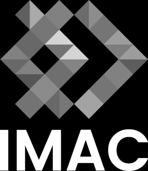
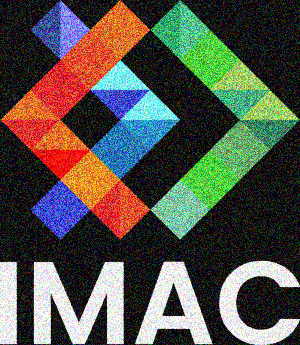
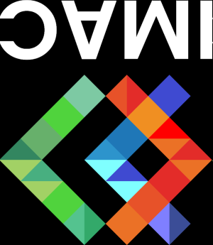
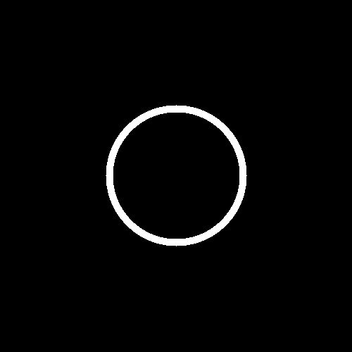
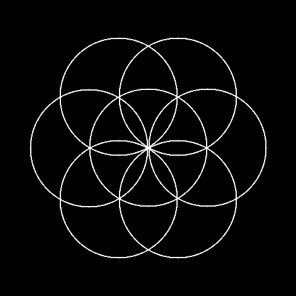
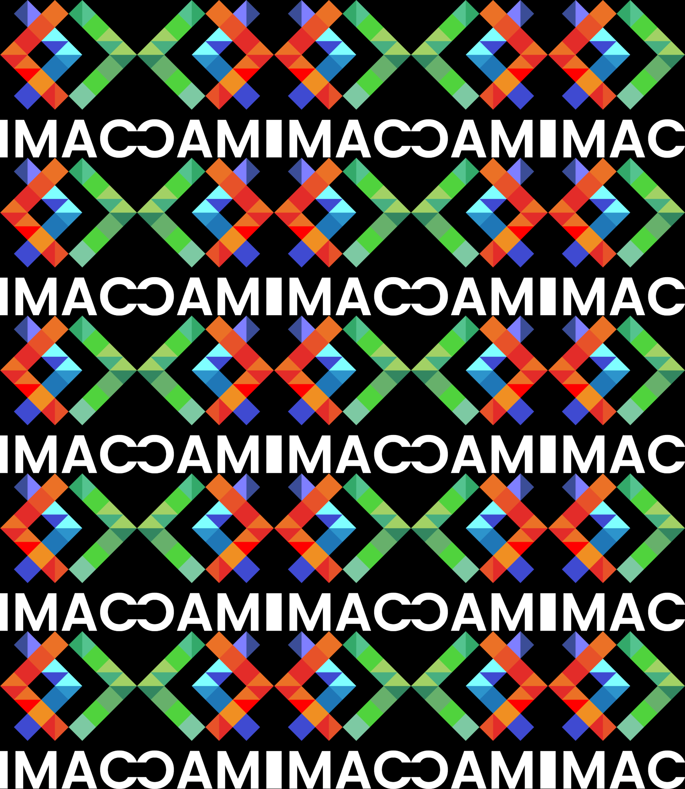
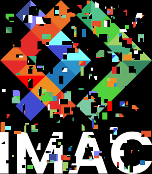

# 🐣 S1 | Prog: Workshop

Super projet d'Elouan ! Vous trouverez le sujet d'origine ici: https://dsmte.github.io/Learn--cpp_programming/Workshop

### Listes des exercices réalisés !
- Ne garder que le vert
  
- échanger des canaux
    
- Noir et blanc
    
- Negatif
    
- Miroir
   
- Image Bruitée
    
- Rotation de 90
  
- RGB Split
  
- Disque
  
- Cercle
  
- Rosace
  
- Mosaique
  
- Mosaique Miroir
  
- Glitch
    
- Fractale de mandelbrot
    

  
Infos supplémentaires 

Le workshop a été fait avec 2 doigts en moins.

  
Infos supplémentaires 

bisous.

